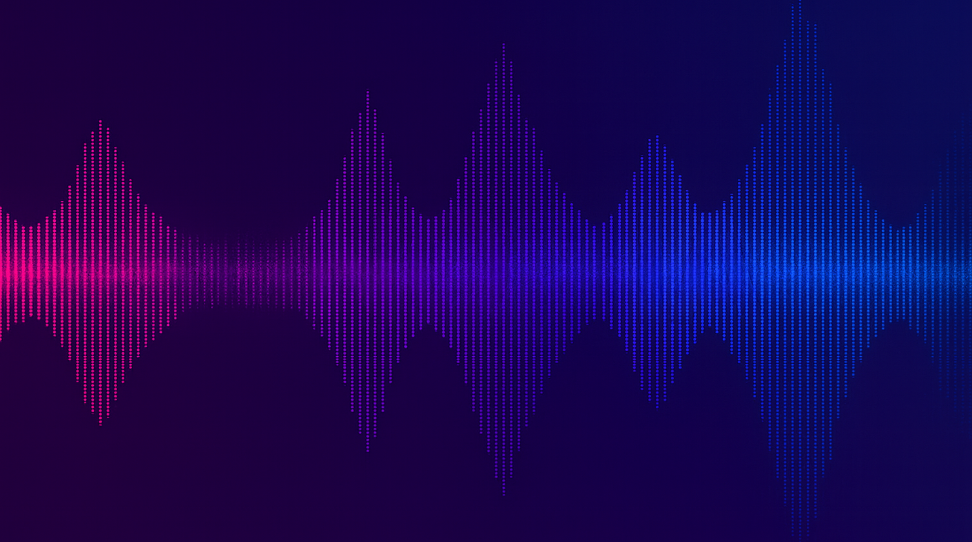

# PEC 3. Visionando el futuro con las gafas de Manovich: redescubriendo la hibridación

En este informe vamos a **analizar dos casos de hibridación: Google Maps y Suno AI**. Ambos son ejemplos de hibridación y reflejan cómo este tipo de software guía la vida contemporánea o incluso cómo lo harán en el futuro.

# Caso 1. GOOGLE MAPS + GOOGLE BUSINESS

  

## 1. ¿Qué es la hibridación de medios?
Según Lev Manovich (2013), la hibridación aparece cuando las lógicas internas de distintos medios se **fusiona** dentro del software para generar **una percepción unificada**.  
No se trata de multimedia (colocar elementos uno al lado de otro) ni de remediación (representar un medio dentro de otro), sino de un **nuevo medio**.

---

## 2. ¿Cómo reconocer esta hibridación?  
Para distinguirla de multimedia o remediación, es clave observar si las lógicas de los medios **actúan de forma única**.  
- En multimedia → cada medio mantiene su identidad.  
- En remediación → un medio se adapta a otro sin transformarse internamente.  
- En hibridación → las técnicas de diferentes medios se integran en la misma experiencia.

Ejemplo para entender esto de forma sencilla es: una web con vídeo y texto es multimedia; un mapa escaneado en PDF es remediación. En En estos casos ninguno fusiona sus partes, sino que actual por separado.  

---

## 3. Google Maps como medio híbrido

Google Maps puede parecer un mapa “vitaminado”, pero su estructura revela una hibridación profunda entre medios antes separados:

### 3.1. Cartografía mediante símbolos  
El mapa vectorial retoma convenciones cartográficas tradicionales, pero el software lo convierte en un objeto interactivo: zoom, capas, orientación y sincronización GPS.

### 3.2. Fotografía por satélite  
Sobre la representación simbólica se superpone la lógica fotográfica: imágenes del territorio en alta resolución. La fusión permite ver el espacio como abstracción y como documento a la vez, algo inexistente antes del ordenador.

### 3.3. Modelado tridimensional  
La vista 3D introduce la lógica geométrica: edificios y relieve. La combinación de 2D, fotografía y 3D genera una representación híbrida del espacio que no pertenece a ningún medio tradicional.

### 3.4. Simulación algorítmica y datos en vivo  
Google Maps incorpora:
- Rutas dinámicas.
- Predicción de tiempos.
- Tráfico en tiempo real.  
- Reconfiguración de trayectos.
- Horarios, fotos y datos generados por usuarios.  

Esto añade la lógica de la simulación y de la base de datos: el mapa **"te conoce y se anticipa"**.

---

## 4. Google Business

### 4.1. Comercios
Las fichas de los comercios integran texto, fotos, vídeos, datos estructurados, valoraciones, horarios y métricas de afluencia. Los comercios se convierte en un escaparate donde exponen lo comercial, narrativo, visual y social.

### 4.2. Participación de lo usuarios  
Usuarios aportan fotos, reseñas, correcciones, preguntas y datos de interés.  
El perfil del comercio se vuelve un **documento colectivo**. Esto añade la lógica de la red social, fusionada con el mapa y la información comercial.

---

## 5. Tipos de hibridación según Manovich

Siguiendo el capítulo 3: La hibridación de *El software toma el mando*, en Google Maps + Business encontramos dos tipos claros:

### 5.1 Hibridación en los datos y la representación
- Mezcla de 2D, fotografía satelital, 3D, simulación y datos sociales  
- Un único medio donde las representaciones no se perciben separadas.

### 5.2 Hibridación en la interfaz 
- Navegación interactiva,  
- Interacción con datos, fotos, reseñas y rutas desde la misma interfaz,  
- Una percepción coherente y unificada, imposible en medios analógicos.

Por ello, Google Maps pertenece totalmente al **nivel 3 del metamedio ordenador**: la creación de nuevos medios mediante fusión de lógicas independientes.

---

## 6. Conclusión y valoración personal

Analizar Google Maps con la perspectiva de Manovich revela que **estamos ante uno de los ejemplos más claros de hibridación en la cultura digital actual**. No es un mapa, ni una red social, ni un comercial electrónico, ni un simulador de rutas: es **todo esto a la vez**, actuando como un único medio.

A nivel personal, este análisis me ha permitido comprender que Google Maps no solo nos guía por el mundo, no es solouna herramienta, sino como un medio complejo, creado por software. Donde mapa, información social y datos algorítmicos conviven en una misma experiencia.

---
---

# Caso 2. SUNO IA  

  

## 1. Introducción: inteligencia artificial

En *El software toma el mando*, Lev Manovich explica cómo el ordenador evoluciona hacia un **metamedio**, capaz no solo de representar medios anteriores, sino de **fusionar lógicas** para crear nuevas formas de representación. Este proceso alcanza su mayor expresión en el **nivel 3: la hibridación profunda**, cuando las técnicas características de medios distintos se integran en una única interface.

Bajo este metamedio aparece **Suno IA**, un sistema capaz de crear **canciones completas a partir de texto natural**: letra, melodía, voz e instrumentos. Suno IA no es un editor, ni un sintetizador, ni un compositor tradicional: es un **medio híbrido** donde lenguaje, música y producción se combinan dentro del software para crear una única experiencia.

---

## 1.1. ¿Cómo distinguir hibridación de multimedia o remediación?

En el ámbito musical, un sistema multimedia coloca elementos uno junto a otro (por ejemplo, un vídeo con letra en pantalla), mientras que la remediación adapta un medio previo, como un sintetizador que imita un instrumento real.
Suno IA no hace ninguna de estas dos cosas: no coloca medios separados ni imita uno anterior, sino que fusiona las lógicas del lenguaje y la composición musical en un único proceso generativo.

---

## 2. ¿Cómo funciona Suno IA? Medios que incorpora

Suno IA es un sistema algorítmico basado en modelos generativos que integran procesos simultáneos: interpretación semántica, composición musical, síntesis vocal y mezcla digital. Esta fusión es la base de su hibridación.

---

### 2.1. Lenguaje natural como base

El proceso comienza con un **prompt**, es decir, una instrucción en lenguaje natural, como por ejemplo:

- “Haz una canción estilo rock sobre trabajar los fines de semana.”
- “Crea una intro alternativa para el anime 'One piece'.”
- “Haz una canción sobre mi gato negro llamado 'Lucas' para expresar que lo quiero.”

El lenguaje y la música son medios tradicionalmente distintos: uno opera con significado verbal, el otro con ritmo, armonía y timbre.  
En Suno IA, el lenguaje **crea** música. Esta primera capa es el comienzo de la composición.

---

### 2.2. Composición musical generada algorítmicamente

La segunda lógica es musical. Suno genera:

- Melodías.
- Armonías.  
- Ritmos.
- Estructuras (verso, estribillo, puente).

Las características de la música —tonalidad, métrica y progresión— se convierten en elementos computables. El sistema actúa como compositor, vocal y editor al mismo tiempo.

---

### 2.3. Voces matemáticas

La voz humana es un medio con lógica propia (respiración, timbre, expresividad).  
Suno la reinterpreta mediante modelos matemáticos, generando voces con caracteristcas similares a las humanas, es decir, sin sonido metálico, simulando las logicas humanas (respiración, timbre, expresividad).

Aquí es donde **Suno crea voces a partir del software**.

---

### 2.4. El estudio de grabación como algoritmo matemático

Suno integra funciones propias de un estudio profesional:

- Mezcla.
- Ecualización.
- Efectos.
- Masterización.

En un proceso tradicional, estas etapas son independientes. En Suno se **fusionan** dentro del modelo generativo. El resultado final es una canción completa que nace del mismo proceso que interpreta el texto.

---

## 3. Tipos de hibridación en Suno IA (según Manovich)

Siguiendo las estrategias descritas por Manovich, en Suno IA se identifican dos tipos clave:

### ✔ Hibridación de datos y representación
Suno fusiona datos lingüísticos (texto), musicales (estructura, armonía), acústicos (timbres) y algorítmicos (modelado sonoro).  
La obra resultante no puede separarse en capas independiente.

### ✔ Hibridación en la interfaz y la experiencia
El usuario no compone, no interpreta y no mezcla.  
**Solo escribe texto**, y todo lo demás ocurre dentro del software.  
La interfaz unifica las lógicas de lenguaje, composición, interpretación y producción, creando una única experiencia.

---

## 4. Valoración personal

Analizar Suno IA desde la perspectiva de Manovich me ha permitido entenderlo como un **medio híbrido emergente**, no como un generador de música aislado. Este nuevo medio reconfigura lo que entendemos por creatividad musical. Suno no sustituye a los medios anteriores sino que crea uno nuevo, propio del metamedio ordenador. Su estudio confirma cómo la hibridación está transformando la cultura digital contemporánea.

---
---

# Bibliografía

- Manovich, Lev. (2013). *El software toma el mando*. UOCpress Comunicación.  
- Google Maps, *Google (2025)*. https://www.google.com/intl/es-419/maps/about/
- Google Business, *Google (2025)*. https://business.google.com/es/business-profile/
- Suno IA. *Suno (2025)*. https://suno.com/about
- OpenAI. (2025). *ChatGPT (versión GPT-5).* https://chat.openai.com/  

---

# Contribución de la IA

La inteligencia artificial ha sido utilizada para apoyar, guiar y aportar ideas en el formato de este informe. 
Imágenes generadas con inteligencia artificial *ChatGPT (versión GPT-5).*  
**El informe no ha sido generado con IA.**

---
**Autor:** David las Heras Ferris
**Fecha de creación:** 12/12/2025
**Asignatura:** 20.644 - Cultura Digital - Aula 1
